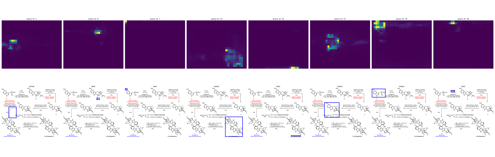
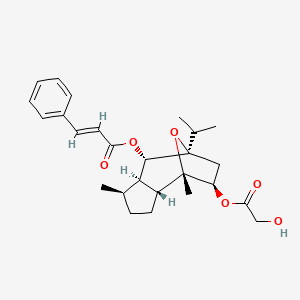
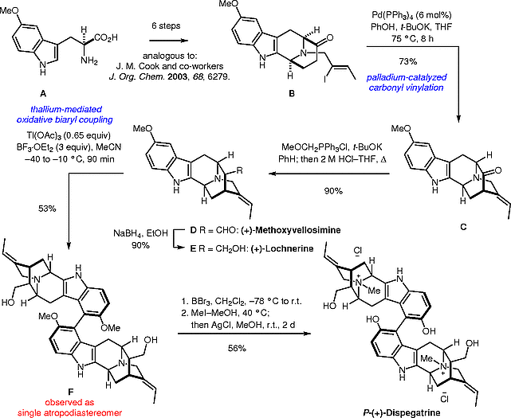
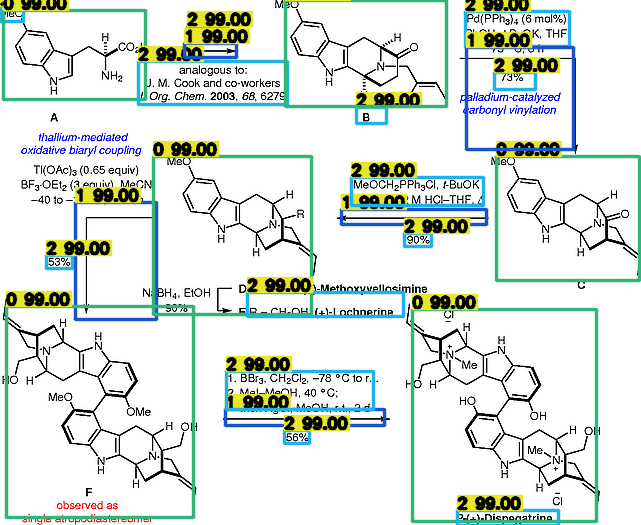
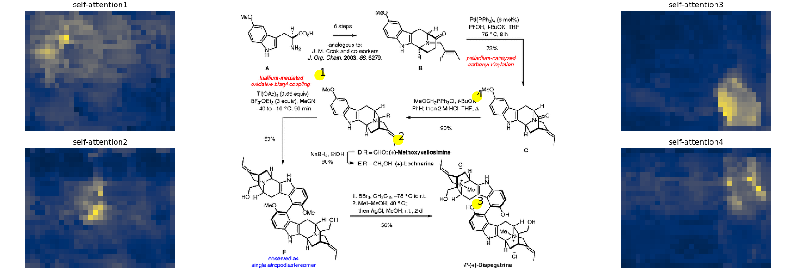
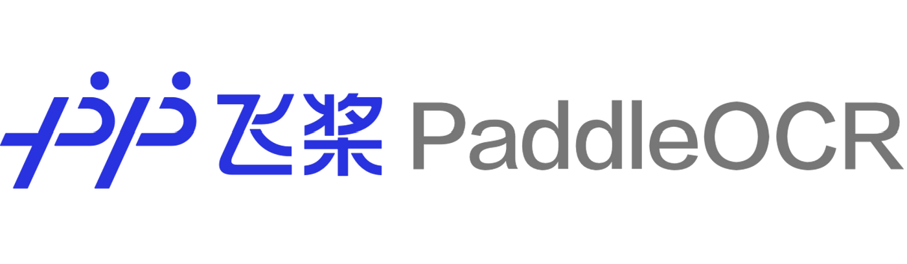
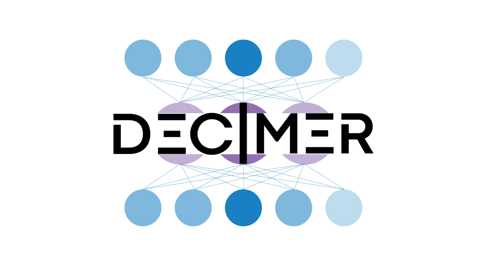
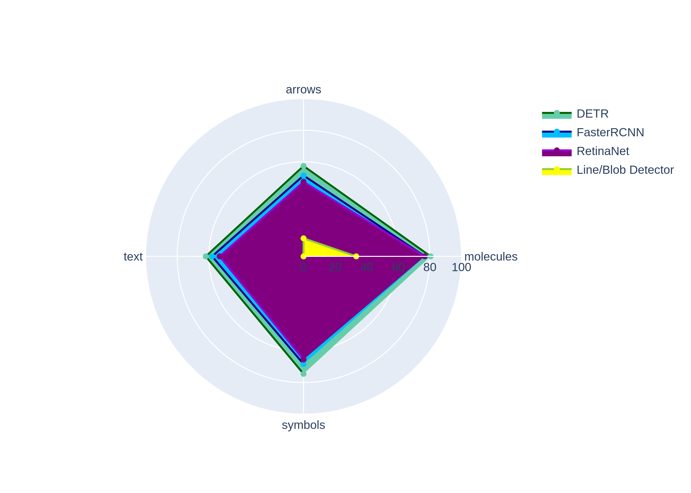

<p align="center">
  <a>
    
  </a>

  <p align="center">
    Digitize your chemical reaction image into a machine-readable representation.
    <br>
    <a>V.0</a>
    ·
    <a href="https://www.zurich.ibm.com">IBM Research Zurich</a>
    <br>
    <a>V.1</</a>
    .
    <a href="https://www.wur.nl/en.htm">Wageningen University & Research</a>
  </p>
</p>

##
<p align="center">
  <a>
    
  </a>
</p>

## Table of contents

- [Description](#Description)
- [Step by step](#step-by-step)
- [Benchmarking](#benchmarking)
- [Installation](#installation)
- [Models - Training - Evaluation - Inference](#Models)
- [Contributing](#contributing)
- [Creators](#creators)
- [Thanks](#thanks)
- [Citing](#citing)


## Description
From a chemical reaction image, detect and classify molecules, text and arrows by using a Vision Transformer (DETR). The detections are then translated into text by using an OCR or into SMILES by using <a href=https://decimer.ai/> DECIMER AI</a>. The direction of the reaction is detected and preserved into the output file.

Input:
<br>
<a></a>
<br>

Output:
```text
SMILES:
CC(C)[C@]12C[C@H]([C@](C)([C@@H]3CC[C@@H](C)[C@H]3[C@@H]1OC(=O)/C(/[2H])=C(\[2H])/C4=CC=CC=C4)O2)OC(=O)CO[2H]​
```

## Step by step
### 1 - Objects detection - ViT
A DETR model with a ResNet50 backbone is used to detect the objects in the image. Classes to be found = ["molecules","arrows","text", "+ symbols"]. Images of type "png" are feed as input and bounding boxes corresponding to the objects locations in a tensor type as well as its respective label are the returned outputs. 
##### Input Image
<p align="center">
  <a>
    
  </a>
</p>

##### Detections
<p align="center">
  <a>
    
  </a>
</p>

##### Training Dataset
Syntetic Dataset consisting of 90k images that are syntheticaly created to simulate the real-world reactions publications distribution.
We also implement a small validation set of 8k images and a testing set of 2k. Also, to see how the model performs, we implement a small dataset with "real-world" reactions extracted from the <a href="https://www.organic-chemistry.org/"> Organic Chemistry Portal</a>

##### Training Parameters
* Learning Rate: 1e-4
* Learning Rate Backbone: 1e-5
* Learning Rate Drop: 22 epochs
* Weight Decay: 1e-5
* Epochs: 30
* Clip Max. Norm.: 0.1
* Dropout: 0.1

##### Multi Head Self-Attention
Encoder-decoder attention files can be found in the Backend-Output-detections path.
<p align="center">
  <a>
    
  </a>
</p>

### 2 - OCR
For Optical Character Recognition (OCR), we used a PaddleOCR model, an open-source tool optimized for extracting text from images. It applies deep learning techniques to detect and recognize text regions, even in complex layouts or low-quality scans. This step was essential for identifying and extracting relevant textual information, such as labels, annotations, or chemical names, from the input documents before structural analysis
<p align="center">
  
</p>


### 3 - DECIMER AI
In order to translate molecules from the input images to SMILES strings we used DECIMER AI, an open-source OCSR that uses deep learning to detect, segment, and recognize chemical structures from scientific documents. It turns images of molecules into machine-readable formats, helping extract chemical data from scanned papers and literature.
<p align="center">
  
</p>


## Output Files
A randomly selected small sample of the test set is evaluated under the folders "test_results" of each approach. DETR, FRCNN and RetinaNet. Check qualitatevly the performance of the models in there.

Aggregating the aforementioned steps outcome, we can reconstruct JSON and text files.
```json
{
    "arrow11": {
        "prev_mol": "CCCC#N.CCCC[Al](CC(C)C)CC(C)C",
        "text": ["-duction of nit-ile", "Coordination of nitrog- pair to the ilum-"],
        "post_mol": "CCCC#[N+3]1(CCC)C(C)(C)C[AlH2]1(O)CC(C)C"
    },
    "arrow5": {
        "prev_mol": "CCCC#[N+3]1(CCC)C(C)(C)C[AlH2]1(O)CC(C)C",
        "text": ["Delivery of hyd-ide to the nitr-- carbon"],
        "post_mol": "CCC/C=N/[Al](CC(C)C)CC(C)C"
    },
    "arrow7": {
        "prev_mol": "CCC/C=N/[Al](CC(C)C)CC(C)C",
        "text": ["H20","Formation o"],
        "post_mol": "CCCC=O"
    }
}
```

## Benchmarking
The synthetic training data set was benchmarked with well-established CNNs and a feature detector approach. As a one-stage detector, RetinaNet. As a two-stages detector, Faster-RCNN. However, DETR with default training schedules performed slightly better. Check the metrics comparison in the folder: plots.

<p align="center">
  <p align="center">mAP score per class and model (%)</p>
  <a>
    
  </a>
</p>

## Installation
- Make sure to have all requirements.txt installed.

- git clone https://github.com/facebookresearch/detr.git

- git clone https://github.com/mindee/doctr.git

## Models
Download the [DETR_Resnet50](https://drive.google.com/drive/folders/1ZIMEQseSTqTmheKGDSijwD8lM0hgrMor?usp=sharing) model and move the file to DETR/detr/output/checkpoint.pth

### Create synthetic data set and train DETR:
- Follow steps in arrow_78/README.md file.

### Evaluation
- DETR/detr/:
    - python3 main.py --batch_size 8 --no_aux_loss --eval --resume "output/checkpoint.pth" --arrow_path "images/val/" --output_dir "output/"

### Inference
- DETR/detr/:
    - python3 attention_DETR.py --resume output/checkpoint.pth

### End-to-End OChemR (From image to JSON)
- Backend/:
    - Store detections and visualize encoder-decoder attention in --output_dir/--detection_dir folder and JSON files in --output_dir/:
      - python3 main.py --data_path images/ --resume /detr/output/checkpoint.pth --detection_dir detections/ --output_dir output/ --device_detr cpu

## Contributing
DETR - https://github.com/facebookresearch/detectron2

DocTr - [https://github.com/mindee/doctr](https://paddlepaddle.github.io/PaddleOCR/main/en/index.html)

MolVec - [https://github.com/ncats/molvec](https://github.com/Kohulan/DECIMER-Image_Transformer)

## Creators
[](https://www.linkedin.com/mark-martori-lopez) Mark Martori Lopez
[](https://www.linkedin.com/in/lucas-silva-perez-983b0a312/) Lucas Silva Perez

[](https://github.com/markmartorilopez)
[](https://github.com/brachingo)

## Thanks
This thesis would not have been possible without the guidance of Dr. Daniel Probst as my supervisor, whom I deeply thank.
Throughout the writing of this dissertation I have received a great deal of support by all my colleagues at the Department of Plant Sciences at WUR.


## Citing
```bib
@software{M.Martori2022,
  author = {Martori, Mark; Probst, Daniel and Silva, Lucas},
  month = {9},
  title = {{Machine Learning approach for chemical reactions digitalisation.}},
  url = {https://github.com/markmartorilopez/,
  version = {0.5},
  year = {2025}
}
```
