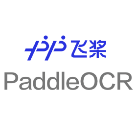

<p align="center">
  <a>
    
  </a>

  <p align="center">
    Digitize your chemical reaction image into a machine-readable representation.
    <br>
    <a>V.0</a>
    ·
    <a href="https://www.zurich.ibm.com">IBM Research Zurich</a>
    <br>
    <a>V.1</</a>
    .
    <a href="https://www.wur.nl/en.htm">Wageningen University & Research</a>
  </p>
</p>

##
<p align="center">
  <a>
    
  </a>
</p>

## Table of contents

- [Description](#Description)
- [Step by step](#step-by-step)
- [Benchmarking](#benchmarking)
- [Installation](#installation)
- [Models - Training - Evaluation - Inference](#Models)
- [Contributing](#contributing)
- [Creators](#creators)
- [Thanks](#thanks)
- [Citing](#citing)


## Description
From a chemical reaction image, detect and classify molecules, text and arrows by using a Vision Transformer. The detections are then translated into text by using an OCR or into SMILES by using <a href=https://decimer.ai/> DECIMER AI</a>. The direction of the reaction is detected and preserved into a `.json` file as output.

Input:
<br>
<a></a>
<br>

Output:
```text
SMILES:
CC(=O)OC1=C(C=CC=C1)C(=O)O
```

## Step by step
### 1 - Objects detection - ViT
A DETR model with a ResNet50 backbone is used to detect the objects in the image. Classes to be found = ["molecules","arrows","text", "+ symbols"]. Images of type "png" are feed as input and bounding boxes corresponding to the objects locations in a tensor type as well as its respective label are the returned outputs. 
##### Input Image
<p align="center">
  <a>
    
  </a>
</p>

##### Detections
<p align="center">
  <a>
    
  </a>
</p>

### 2 - Training Dataset
Syntetic Dataset consisting of 60k images that are syntheticaly created to simulate the real-world reactions publications distribution.
We also implement a small validation set of 8k images and a testing set of 2k. Also, to see how the model performs, we implement a small dataset with "real-world" reactions extracted from the <a href="https://www.organic-chemistry.org/"> Organic Chemistry Portal</a>


### 3 - OCR
For Optical Character Recognition (OCR), we used a PaddleOCR model, an open-source tool optimized for extracting text from images. It applies deep learning techniques to detect and recognize text regions, even in complex layouts or low-quality scans. This step was essential for identifying and extracting relevant textual information, such as labels, annotations, or chemical names, from the input documents before structural analysis
<p align="center">
  
</p>


### 4 - DECIMER AI
In order to translate molecules from the input images to SMILES strings we used DECIMER AI, an open-source OCSR that uses deep learning to detect, segment, and recognize chemical structures from scientific documents. It turns images of molecules into machine-readable formats, helping extract chemical data from scanned papers and literature.
<p align="center">
  
</p>

### 5 - Arrow direction
The direction of the reaction is detected by using a simple heuristic. The algorithm checks the position of the arrows and the molecules in the image. It uses the coordinates of the bounding boxes to determine the direction of the reaction. The algorithm then assigns a direction to each arrow based on its position relative to the molecules.
<p align="center">
  
  
</p>


## Output Files
A randomly selected small sample of the test set is evaluated under the folders "test_results" of each approach. DETR, FRCNN and RetinaNet. Check qualitatevly the performance of the models in there.

Aggregating the aforementioned steps outcome, we can reconstruct JSON and text files.
```json
{
    "arrow11": {
        "prev_mol": "CCCC#N.CCCC[Al](CC(C)C)CC(C)C",
        "text": ["-duction of nit-ile", "Coordination of nitrog- pair to the ilum-"],
        "post_mol": "CCCC#[N+3]1(CCC)C(C)(C)C[AlH2]1(O)CC(C)C"
    },
    "arrow5": {
        "prev_mol": "CCCC#[N+3]1(CCC)C(C)(C)C[AlH2]1(O)CC(C)C",
        "text": ["Delivery of hyd-ide to the nitr-- carbon"],
        "post_mol": "CCC/C=N/[Al](CC(C)C)CC(C)C"
    },
    "arrow7": {
        "prev_mol": "CCC/C=N/[Al](CC(C)C)CC(C)C",
        "text": ["H20","Formation o"],
        "post_mol": "CCCC=O"
    }
}
```

## Installation
- Make sure to have all requirements.txt installed.

- git clone [DETR Fine-Tuning](https://github.com/woctezuma/finetune-detr)

### Create synthetic data set and train DETR:
- Follow steps in arrow_78/README.md file.

### Evaluation
- DETR/detr/:
    - python3 main.py --batch_size 8 --no_aux_loss --eval --resume "output/checkpoint.pth" --arrow_path "images/val/" --output_dir "output/"

### Inference
- DETR/detr/:
    - python3 attention_DETR.py --resume output/checkpoint.pth

### End-to-End OChemR (From image to JSON)
- Backend/:
    - Run file `end_to_end.lsf` in the terminal. This will run the whole pipeline from image to JSON file. The output will be saved in the folder `output/`.
    - If `--debugging` is set to True, the output from arrow and molecule detection will be saved in their respective folders. 

## Contributing
DETR - https://github.com/facebookresearch/detectron2

PaddleOCR - [paddlepaddle.github.io](https://paddlepaddle.github.io/PaddleOCR/main/en/ppocr/quick_start.html)

DECIMER AI - [https://decimer.ai/](https://decimer.ai/)

## Creators
[](https://www.linkedin.com/mark-martori-lopez) Mark Martori Lopez
[](https://www.linkedin.com/in/lucas-silva-perez-983b0a312/) Lucas Silva Perez

[](https://github.com/markmartorilopez)
[](https://github.com/brachingo)

## Thanks
This thesis would not have been possible without the guidance of Dr. Daniel Probst as my supervisor, and the previous work done by Mark Martori, whom I deeply thank, .
Throughout the writing of this dissertation I have received a great deal of support by all my colleagues at the Department of Plant Sciences at WUR.


## Citing
```bib
@software{LSilva2025,
  author = {Martori, Mark; Probst, Daniel and Silva, Lucas},
  title = {{Machine Learning approach for chemical reactions digitalisation.}},
  url = {https://github.com/Brachingo/OChemR},
  version = {1.5},
  year = {2025}
}
```
